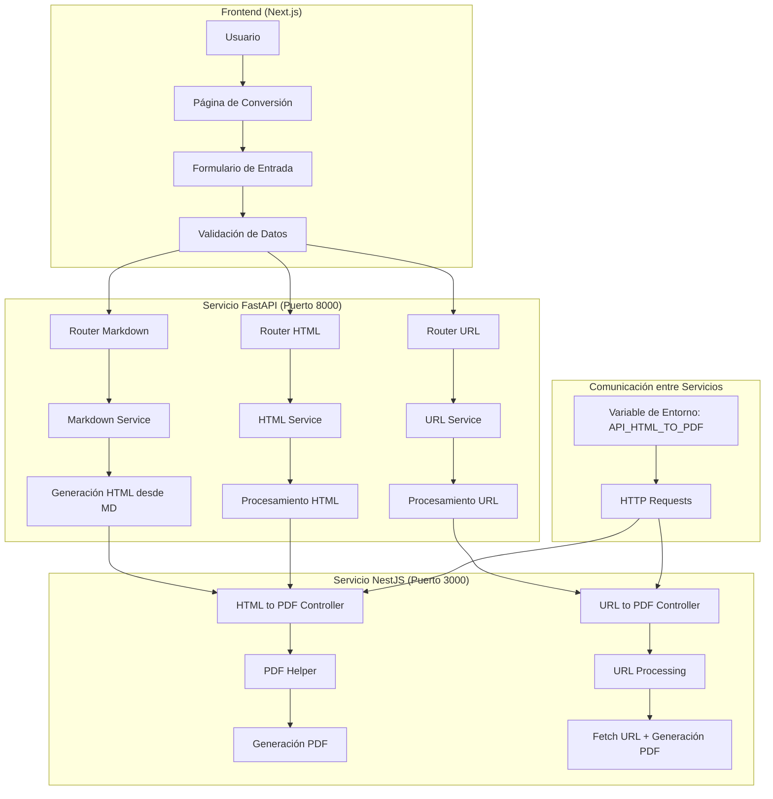
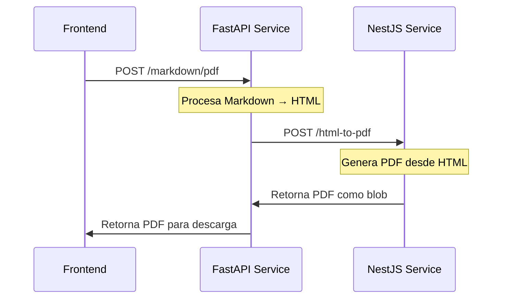
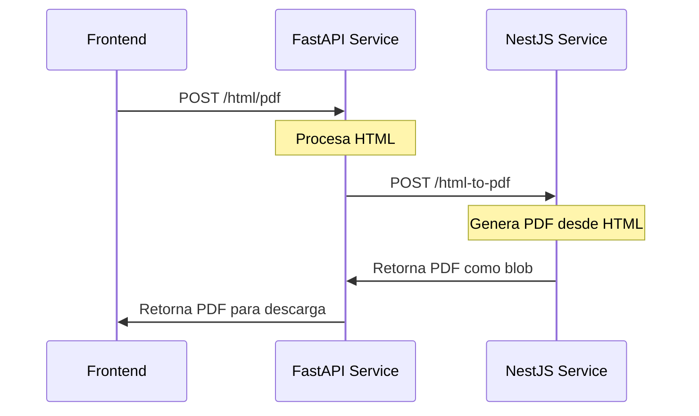
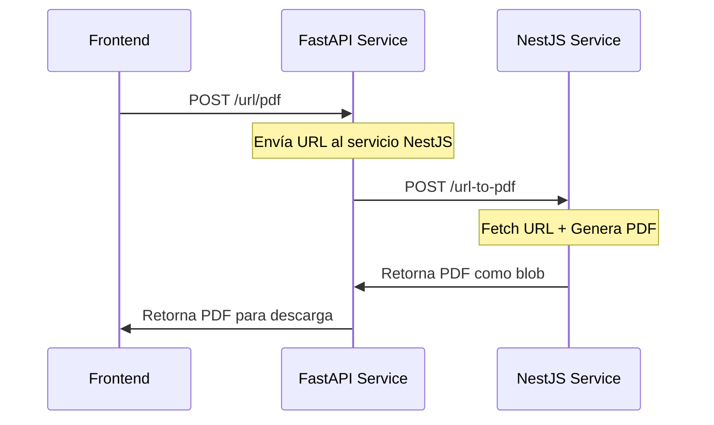

# Arquitectura del Sistema MD/HTML to PDF

## Descripción General

Este sistema es una aplicación de conversión de documentos que permite transformar Markdown, HTML y URLs en archivos PDF. La arquitectura está compuesta por tres componentes principales:

1. **Frontend (Next.js)** - Interfaz de usuario
2. **Servicio FastAPI** - Procesamiento de Markdown y HTML
3. **Servicio NestJS** - Generación de PDFs

## Diagrama de Arquitectura



## Flujo de Datos Detallado

### 1. Conversión de Markdown a PDF



### 2. Conversión de HTML a PDF



### 3. Conversión de URL a PDF



## Análisis de la Comunicación

### Comunicación Frontend → FastAPI

- **Endpoint Base**: `NEXT_PUBLIC_APP_BACK_END` (configurado en variables de entorno)
- **Rutas disponibles**:
  - `/markdown/pdf` - Conversión Markdown a PDF
  - `/markdown/html` - Conversión Markdown a HTML
  - `/html/pdf` - Conversión HTML a PDF
  - `/html/html` - Procesamiento HTML
  - `/url/pdf` - Conversión URL a PDF

### Comunicación FastAPI → NestJS

- **Variable de Entorno**: `API_HTML_TO_PDF` (debe apuntar al servicio NestJS)
- **Endpoints utilizados**:
  - `/html-to-pdf` - Para conversiones HTML/Markdown
  - `/url-to-pdf` - Para conversiones de URL

### Estructura de Datos

```typescript
interface PdfRequest {
  title: string;
  content?: string;      // Para Markdown/HTML
  url?: string;          // Para URLs
  css?: string;          // Estilos CSS
  size?: "A4" | "mm80" | "mm58";
  width?: string;        // Tamaño personalizado
  height?: string;       // Tamaño personalizado
  margin: {
    top: number;
    right: number;
    bottom: number;
    left: number;
  };
}
```

## Puntos de Mejora Identificados

### 1. **Gestión de Errores**
- **Problema**: Los servicios no tienen un manejo de errores estandarizado
- **Mejora**: Implementar un sistema de códigos de error HTTP consistentes y mensajes de error estructurados

### 2. **Logging y Monitoreo**
- **Problema**: Solo hay logging básico en FastAPI
- **Mejora**: Implementar logging estructurado, métricas y health checks en ambos servicios

### 3. **Validación de Datos**
- **Problema**: La validación se hace principalmente en el frontend
- **Mejora**: Implementar validación robusta en ambos servicios backend

### 4. **Rate Limiting y Seguridad**
- **Problema**: No hay protección contra abuso o ataques
- **Mejora**: Implementar rate limiting, autenticación y validación de entrada

### 5. **Caché y Performance**
- **Problema**: No hay sistema de caché para conversiones repetidas
- **Mejora**: Implementar Redis para caché de PDFs generados

### 6. **Arquitectura de Microservicios**
- **Problema**: Los servicios están acoplados a través de variables de entorno
- **Mejora**: Implementar service discovery, load balancing y circuit breakers

### 7. **Testing**
- **Problema**: No hay tests unitarios o de integración visibles
- **Mejora**: Implementar suite completa de testing (unit, integration, e2e)

### 8. **Documentación de API**
- **Problema**: Solo NestJS tiene Swagger configurado
- **Mejora**: Documentar todas las APIs con OpenAPI/Swagger

## Recomendaciones de Implementación

### Fase 1: Estabilización
1. Implementar manejo de errores consistente
2. Agregar logging estructurado
3. Implementar health checks
4. Agregar validación de datos robusta

### Fase 2: Seguridad y Performance
1. Implementar autenticación y autorización
2. Agregar rate limiting
3. Implementar sistema de caché
4. Optimizar generación de PDFs

### Fase 3: Escalabilidad
1. Implementar service discovery
2. Agregar load balancing
3. Implementar circuit breakers
4. Agregar métricas y monitoreo

### Fase 4: Testing y Documentación
1. Implementar tests unitarios
2. Agregar tests de integración
3. Documentar todas las APIs
4. Crear guías de desarrollo

## Conclusión

El sistema tiene una arquitectura funcional pero con oportunidades significativas de mejora. La separación de responsabilidades entre FastAPI (procesamiento) y NestJS (generación PDF) es buena, pero la comunicación entre servicios podría ser más robusta. Las mejoras sugeridas transformarían este sistema en una solución empresarial escalable y mantenible.
