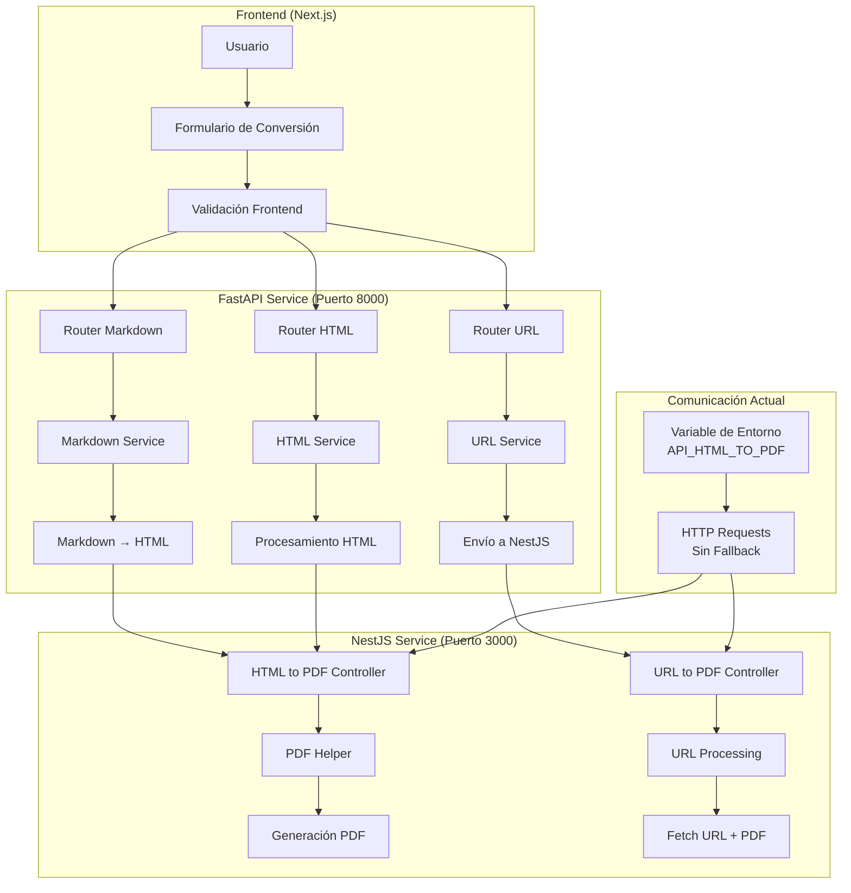
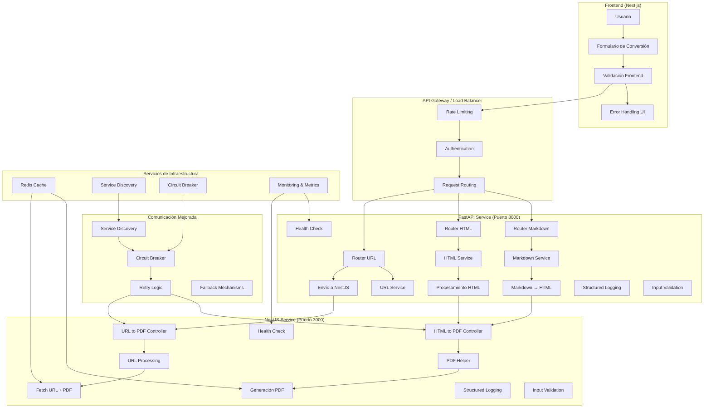
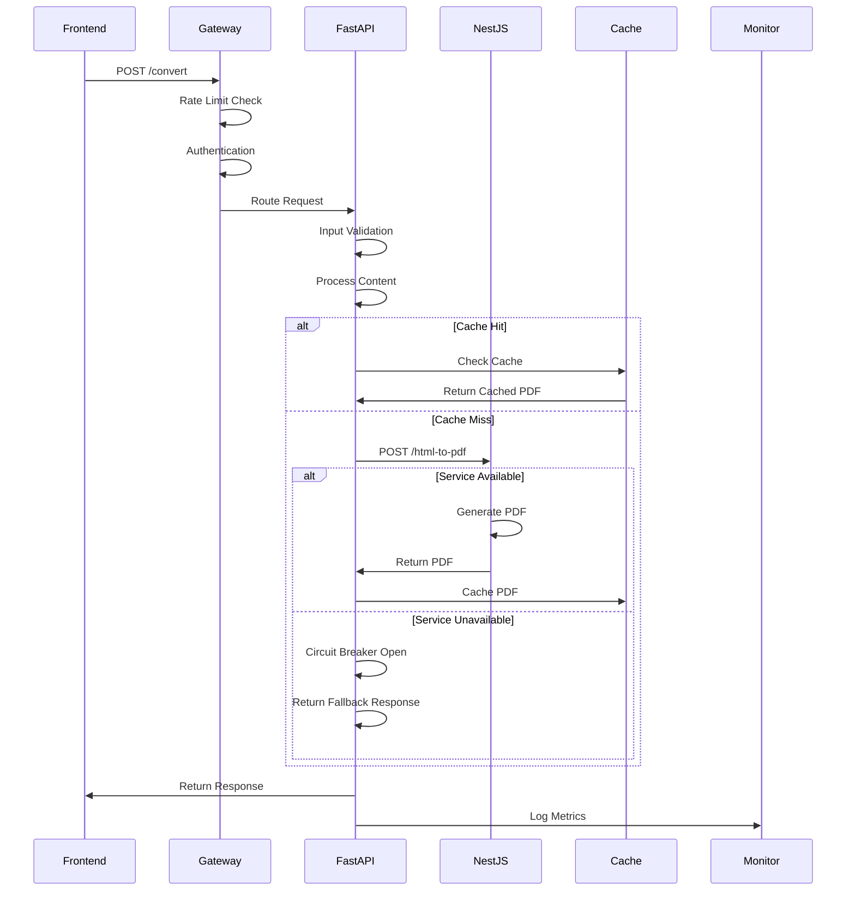
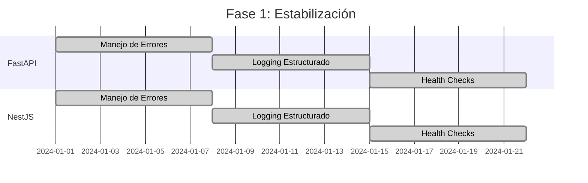
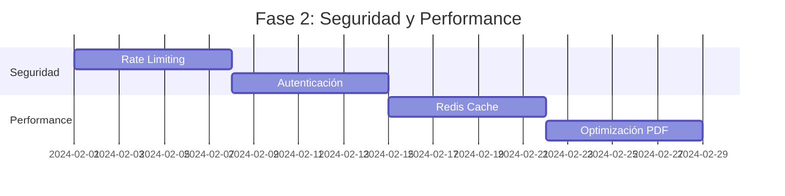
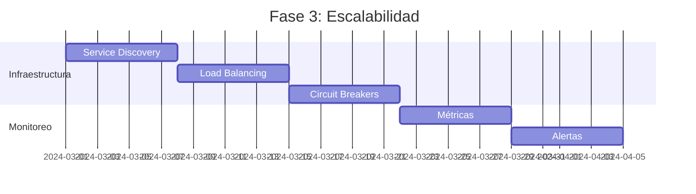

# Diagrama de Arquitectura Actual vs Propuesta

## Arquitectura Actual

## Arquitectura Propuesta con Mejoras

## Comparación de Características

| Aspecto | Arquitectura Actual | Arquitectura Propuesta |
|---------|-------------------|----------------------|
| **Comunicación** | HTTP directo con variables de entorno | Service discovery + circuit breakers |
| **Manejo de Errores** | Básico, no estandarizado | Estructurado con códigos HTTP consistentes |
| **Logging** | Solo en FastAPI | Estructurado en ambos servicios |
| **Validación** | Principalmente en frontend | Backend robusto + frontend |
| **Seguridad** | CORS básico | Rate limiting + autenticación |
| **Performance** | Sin caché | Redis + optimizaciones |
| **Monitoreo** | No disponible | Health checks + métricas |
| **Escalabilidad** | Manual | Auto-scaling + load balancing |
| **Testing** | No visible | Suite completa de tests |
| **Documentación** | Parcial (solo NestJS) | OpenAPI completo |

## Flujo de Datos Mejorado

### Con Circuit Breaker y Fallback

## Implementación Gradual

### Fase 1: Estabilización (2-3 semanas)

### Fase 2: Seguridad y Performance (3-4 semanas)

### Fase 3: Escalabilidad (4-5 semanas)

## Beneficios de las Mejoras

### Técnicos
- **Resiliencia**: Circuit breakers y fallbacks
- **Performance**: Caché y optimizaciones
- **Observabilidad**: Logging y métricas estructuradas
- **Escalabilidad**: Auto-scaling y load balancing

### Operacionales
- **Mantenibilidad**: Código más limpio y testeable
- **Debugging**: Mejor trazabilidad de errores
- **Deployment**: CI/CD más robusto
- **Monitoreo**: Alertas proactivas

### Empresariales
- **Confiabilidad**: Mayor uptime y disponibilidad
- **Eficiencia**: Menor tiempo de respuesta
- **Escalabilidad**: Soporte para más usuarios
- **Cumplimiento**: Mejores prácticas de seguridad
