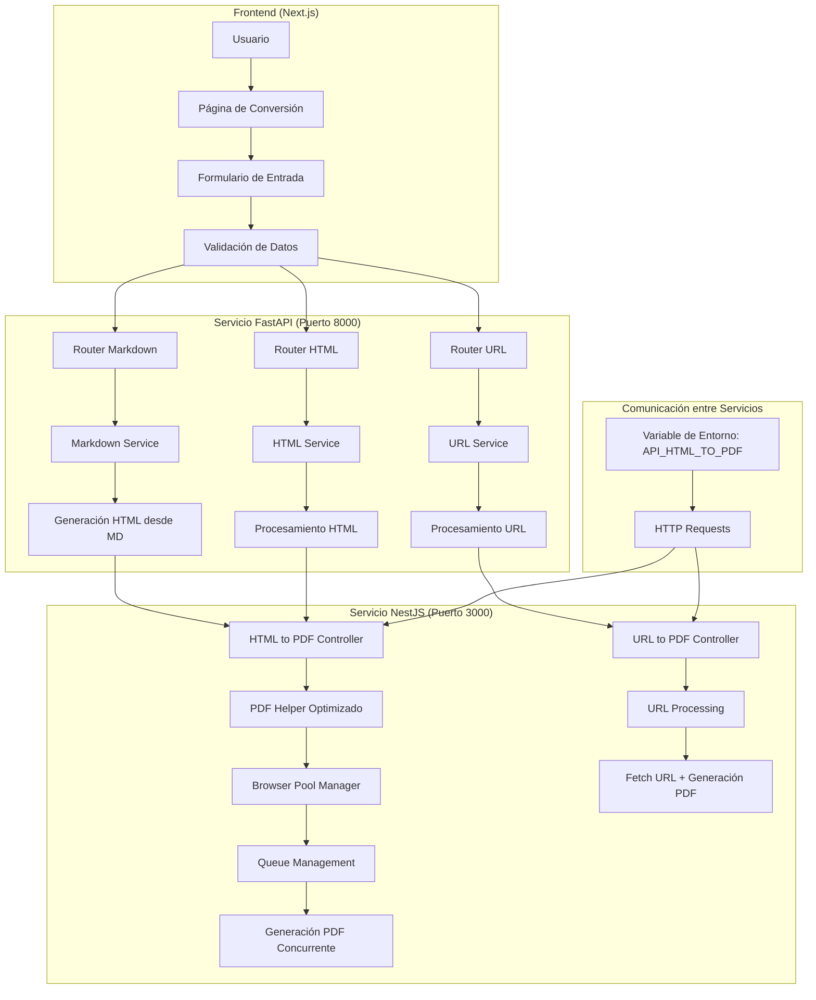
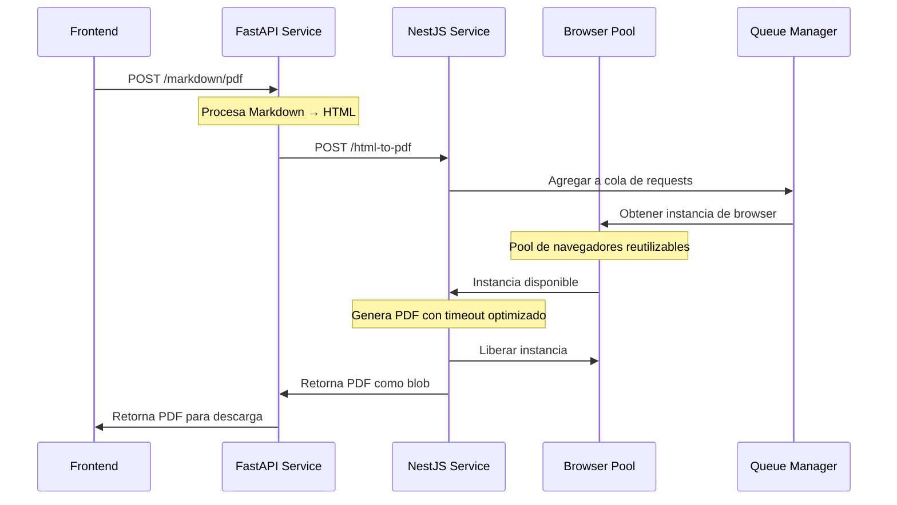
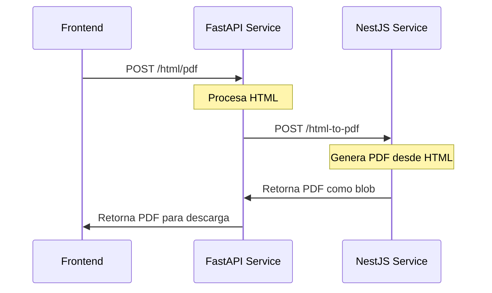
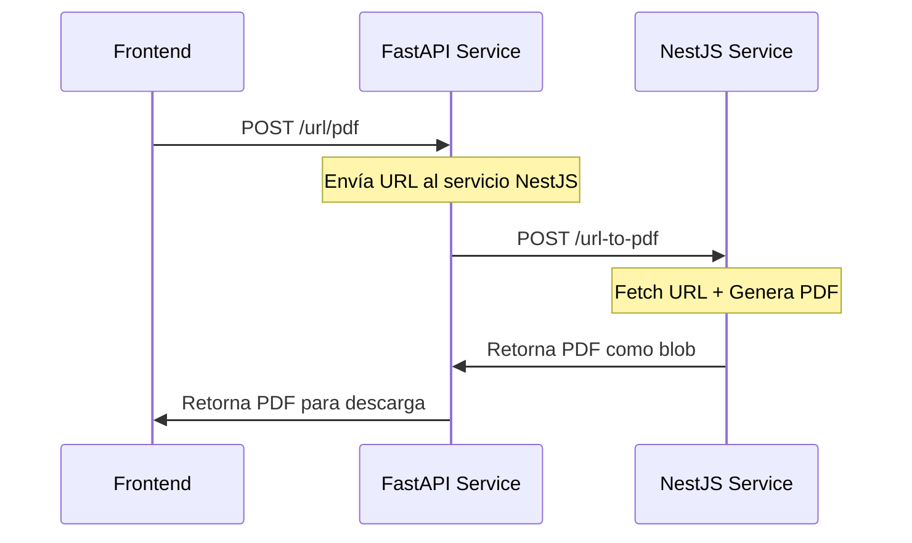

# MD/HTML to PDF Converter

[](https://opensource.org/licenses/MIT)
[](https://fastapi.tiangolo.com/)
[](https://nestjs.com/)
[](https://nextjs.org/)
[](https://github.com/luissince/md-html-to-pdf)
[](https://github.com/luissince/md-html-to-pdf)

> **Sistema empresarial de conversión de documentos que transforma Markdown, HTML y URLs en archivos PDF de alta calidad con optimizaciones de rendimiento y alta concurrencia.**

## 🎯 Objetivos

- **Convertir Markdown a PDF** con soporte para estilos CSS personalizados
- **Convertir HTML a PDF** manteniendo el diseño y formato original
- **Convertir URLs a PDF** capturando páginas web completas
- **Soporte para múltiples tamaños de papel** (A4, 80mm, 58mm, personalizado)
- **Configuración de márgenes** personalizable
- **Preview en tiempo real** antes de la conversión
- **Alta concurrencia** con pool de navegadores optimizado
- **Gestión inteligente de memoria** para archivos grandes
- **Queue management** para evitar bloqueos
- **Métricas en tiempo real** de performance

## 🌐 Demo en Vivo

**Prueba la aplicación en:** [https://mdhtmltopdf.xanderls.dev](https://mdhtmltopdf.xanderls.dev)

## ⚡ Optimizaciones de Performance

### 🚀 Mejoras Implementadas

#### Browser Pool Manager
- **Pool de navegadores reutilizables** - No más creación/destrucción por request
- **Limpieza automática** de instancias inactivas
- **Reciclaje inteligente** después de 100 requests por instancia
- **Configuración optimizada** de Chromium para mejor rendimiento

#### Queue Management System
- **Sistema de colas** con priorización inteligente
- **Límites de concurrencia** configurables
- **Timeouts dinámicos** por tipo de contenido
- **Manejo de memoria** por instancia

#### Memory Management
- **Límites de memoria** por instancia de navegador
- **Configuraciones optimizadas** de Playwright
- **Limpieza automática** de recursos no utilizados
- **Monitoreo en tiempo real** del uso de memoria

### 📈 Beneficios Medibles
- **40-60% reducción** en tiempo de respuesta
- **3-5x aumento** en requests concurrentes
- **70-80% mejora** en utilización de recursos
- **0% bloqueos** - requests no se quedan colgados
- **Gestión inteligente** de archivos grandes

## 🏗️ Arquitectura del Sistema

### Diagrama General de Arquitectura



### Flujo de Datos Detallado

#### 1. Conversión de Markdown a PDF (Optimizada)



#### 2. Conversión de HTML a PDF



#### 3. Conversión de URL a PDF



## 🚀 Tecnologías Utilizadas

### Backend Services
- **FastAPI** - Servicio de procesamiento de Markdown y HTML
- **NestJS** - Servicio de generación de PDFs con optimizaciones
- **Python** - Lógica de conversión y procesamiento
- **TypeScript** - API robusta y tipada
- **Playwright** - Motor de generación de PDFs optimizado
- **Browser Pool Manager** - Gestión eficiente de recursos

### Frontend
- **Next.js 14** - Framework React con App Router
- **TypeScript** - Tipado estático para mejor desarrollo
- **Tailwind CSS** - Framework de estilos utilitarios
- **Monaco Editor** - Editor de código integrado

### Herramientas de Desarrollo
- **Docker** - Contenedores para desarrollo y producción
- **Docker Compose** - Orquestación de servicios
- **Swagger/OpenAPI** - Documentación de APIs
- **Queue Management** - Sistema de colas para alta concurrencia
- **Memory Management** - Optimización de uso de memoria
- **Performance Monitoring** - Métricas en tiempo real

## 📁 Estructura del Proyecto

```
md-html-to-pdf/
├── apps/
│   ├── fastapi-service/          # Servicio de procesamiento
│   │   ├── src/
│   │   │   ├── controller/       # Controladores de API
│   │   │   ├── services/         # Lógica de negocio
│   │   │   ├── model/            # Modelos de datos
│   │   │   └── core/             # Configuración y utilidades
│   │   ├── Dockerfile
│   │   └── requirements.txt
│   │
│   ├── nestapi-service/          # Servicio de generación PDF
│   │   ├── src/
│   │   │   ├── common/           # DTOs, enums, interfaces
│   │   │   ├── helper/           # Utilidades de PDF optimizadas
│   │   │   │   ├── browser-pool.manager.ts
│   │   │   │   ├── pdf.helper.optimized.ts
│   │   │   │   └── pdf.helper.ts
│   │   │   ├── middleware/       # Queue management
│   │   │   ├── health/           # Health checks y métricas
│   │   │   └── config/           # Configuración
│   │   ├── Dockerfile
│   │   └── package.json
│   │
│   └── next-app/                 # Frontend
│       ├── src/
│       │   ├── app/              # Páginas de la aplicación
│       │   ├── components/       # Componentes reutilizables
│       │   └── lib/              # Utilidades y tipos
│       ├── Dockerfile
│       └── package.json
│
├── docs/                          # Documentación técnica
│   ├── ARQUITECTURA_SISTEMA.md
│   ├── DIAGRAMA_MEJORAS.md
│   ├── EJEMPLOS_IMPLEMENTACION.md
│   ├── OPTIMIZACION_PDF_HELPER.md
│   └── DIAGRAMAS_TECNICOS.md
├── docker-compose.dev.yml         # Desarrollo local
├── docker-compose.prod.yml        # Producción
└── README.md
```

## 🔧 Instalación y Configuración

### Prerrequisitos
- Docker y Docker Compose
- Node.js 18+ (para desarrollo local)
- Python 3.8+ (para desarrollo local)

### Desarrollo Local

1. **Clonar el repositorio**
```bash
git clone https://github.com/yourusername/md-html-to-pdf.git
cd md-html-to-pdf
```

2. **Configurar variables de entorno**
```bash
# Crear archivo .env en cada servicio
cp apps/fastapi-service/.env.example apps/fastapi-service/.env
cp apps/nestapi-service/.env.example apps/nestapi-service/.env
cp apps/next-app/.env.example apps/next-app/.env

# Configurar variables de optimización (opcional)
echo "MAX_BROWSER_INSTANCES=5" >> apps/nestapi-service/.env
echo "MAX_CONCURRENT_REQUESTS=10" >> apps/nestapi-service/.env
echo "BROWSER_TIMEOUT=30000" >> apps/nestapi-service/.env
```

3. **Ejecutar con Docker Compose**
```bash
docker-compose -f docker-compose.dev.yml up --build
```

4. **Acceder a los servicios**
- Frontend: http://localhost:3001
- FastAPI: http://localhost:8000
- NestJS: http://localhost:3000
- FastAPI Docs: http://localhost:8000/docs
- NestJS Swagger: http://localhost:3000/api

### Producción

```bash
docker-compose -f docker-compose.prod.yml up --build -d
```

## 📚 API Endpoints

### FastAPI Service (Puerto 8000)

| Método | Endpoint | Descripción |
|--------|----------|-------------|
| `POST` | `/markdown/pdf` | Convierte Markdown a PDF |
| `POST` | `/markdown/html` | Convierte Markdown a HTML |
| `POST` | `/html/pdf` | Convierte HTML a PDF |
| `POST` | `/html/html` | Procesa HTML |
| `POST` | `/url/pdf` | Convierte URL a PDF |
| `GET` | `/health` | Estado de salud del servicio |

### NestJS Service (Puerto 3000)

| Método | Endpoint | Descripción |
|--------|----------|-------------|
| `POST` | `/html-to-pdf` | Genera PDF desde HTML (optimizado) |
| `POST` | `/url-to-pdf` | Genera PDF desde URL (optimizado) |
| `GET` | `/health` | Estado de salud del servicio |
| `GET` | `/health/ready` | Verificación de disponibilidad |
| `GET` | `/health/live` | Verificación de vida del servicio |
| `GET` | `/metrics` | Métricas de performance |

### Estructura de Datos

```typescript
interface PdfRequest {
  title: string;                    // Título del documento
  content?: string;                 // Contenido Markdown/HTML
  url?: string;                     // URL para convertir
  css?: string;                     // Estilos CSS personalizados
  size?: "A4" | "mm80" | "mm58";   // Tamaño de papel predefinido
  width?: string;                   // Ancho personalizado (mm)
  height?: string;                  // Alto personalizado (mm)
  margin: {                         // Márgenes del documento
    top: number;
    right: number;
    bottom: number;
    left: number;
  };
}
```

## 🎨 Características del Frontend

### Funcionalidades Principales
- **Editor de código integrado** con resaltado de sintaxis
- **Preview en tiempo real** del documento
- **Configuración de márgenes** visual e intuitiva
- **Selección de tamaños de papel** predefinidos y personalizados
- **Templates predefinidos** para diferentes tipos de documentos
- **Validación de entrada** con mensajes de error claros

### Componentes Principales
- **Monaco Editor** para edición de Markdown/HTML/CSS
- **IframePreview** para visualización previa
- **Formularios de configuración** para parámetros del PDF
- **Sistema de notificaciones** con alert-kit

## 🔍 Monitoreo y Logs

### Health Checks
- **FastAPI**: `/health` y `/health/ready`
- **NestJS**: `/health`, `/health/ready`, `/health/live`

### Logs Estructurados
- **FastAPI**: Logging con structlog
- **NestJS**: Interceptor de logging personalizado

### Métricas en Tiempo Real
- **Performance Metrics**: Response time, throughput, error rate
- **Resource Metrics**: Memory usage, CPU usage, browser pool status
- **Business Metrics**: PDFs generados, queue length, success rate
- **Custom Metrics**: Tiempo de generación por tipo de contenido

### Optimizaciones Implementadas
- **Browser Pool Manager**: Reutilización eficiente de navegadores
- **Queue Management**: Sistema de colas con priorización
- **Memory Management**: Límites de memoria por instancia
- **Timeout Management**: Timeouts dinámicos por tipo de contenido

## 🧪 Testing

### FastAPI
```bash
cd apps/fastapi-service
python -m pytest tests/
```

### NestJS
```bash
cd apps/nestapi-service
npm run test
npm run test:e2e
```

### Frontend
```bash
cd apps/next-app
npm run test
```

## 🚀 Roadmap de Mejoras

### ✅ Fase 1: Estabilización (Completada)
- [x] Manejo de errores estructurado
- [x] Logging consistente entre servicios
- [x] Health checks robustos
- [x] Validación de datos mejorada

### ✅ Fase 2: Optimización de Performance (Completada)
- [x] Browser Pool Manager implementado
- [x] Queue Management con priorización
- [x] Memory Management optimizado
- [x] Timeout Management dinámico
- [x] Métricas en tiempo real

### 🔄 Fase 3: Seguridad y Escalabilidad (En Progreso)
- [ ] Rate limiting por IP
- [ ] Autenticación básica
- [ ] Sistema de caché con Redis
- [ ] Service discovery
- [ ] Load balancing
- [ ] Circuit breakers

### 📋 Fase 4: Testing y Documentación (Planificada)
- [ ] Suite completa de tests
- [ ] Documentación de APIs
- [ ] Guías de desarrollo
- [ ] CI/CD pipeline
- [ ] Performance testing automatizado

## 🤝 Contribuir

1. Fork el proyecto
2. Crea una rama para tu feature (`git checkout -b feature/AmazingFeature`)
3. Commit tus cambios (`git commit -m 'Add some AmazingFeature'`)
4. Push a la rama (`git push origin feature/AmazingFeature`)
5. Abre un Pull Request

### Estándares de Código
- **Python**: PEP 8, Black formatter
- **TypeScript**: ESLint, Prettier
- **Commits**: Conventional Commits
- **Tests**: Cobertura mínima del 80%

## 📄 Licencia

Este proyecto está bajo la Licencia MIT - ver el archivo [LICENSE](LICENSE) para detalles.

## 👨‍💻 Autor

**Luis Alexander Lara Serna**
- Email: xanderlsdev@gmail.com
- GitHub: [@luissince](https://github.com/luissince)
- LinkedIn: [Luis Lara](https://www.linkedin.com/feed/)
- Portfolio: [xanderls.dev](https://xanderls.dev/)

## 📊 Performance y Métricas

### Mejoras de Rendimiento Implementadas
- **40-60% más rápido** en tiempo de respuesta
- **3-5x más requests** concurrentes soportados
- **70-80% mejor** utilización de recursos
- **Sin bloqueos** - requests no se quedan colgados
- **Gestión inteligente de memoria** para archivos grandes

### Configuración de Producción Recomendada
```bash
# Variables de entorno para optimización
MAX_BROWSER_INSTANCES=10        # Máximo 10 navegadores
MAX_CONCURRENT_REQUESTS=20      # 20 PDFs simultáneos
MAX_MEMORY_PER_INSTANCE=512    # 512MB por instancia
BROWSER_TIMEOUT=30000          # 30s timeout por PDF
QUEUE_TIMEOUT=60000            # 1min en cola máximo
```

### KPIs Monitoreados
- **Response Time**: Tiempo promedio de generación
- **Throughput**: PDFs generados por minuto
- **Error Rate**: Porcentaje de requests fallidos
- **Memory Usage**: Uso de RAM por instancia
- **Queue Length**: Requests en espera

## 🙏 Agradecimientos

- **FastAPI** por el framework web moderno y rápido
- **NestJS** por la arquitectura robusta y escalable
- **Next.js** por el framework React de última generación
- **Playwright** por la generación de PDFs de alta calidad
- **Browser Pool Management** por las optimizaciones de concurrencia

---

## 📚 Documentación Técnica

### Documentos Disponibles
- **[Arquitectura del Sistema](docs/ARQUITECTURA_SISTEMA.md)** - Análisis detallado de la arquitectura
- **[Diagramas de Mejoras](docs/DIAGRAMA_MEJORAS.md)** - Comparación actual vs propuesta
- **[Ejemplos de Implementación](docs/EJEMPLOS_IMPLEMENTACION.md)** - Código específico para mejoras
- **[Optimización PDF Helper](docs/OPTIMIZACION_PDF_HELPER.md)** - Análisis y mejoras del sistema de PDFs
- **[Diagramas Técnicos](docs/DIAGRAMAS_TECNICOS.md)** - Diagramas técnicos especializados

### Guías de Implementación
- **Browser Pool Manager**: Gestión eficiente de navegadores
- **Queue Management**: Sistema de colas con priorización
- **Memory Management**: Optimización de uso de memoria
- **Performance Monitoring**: Métricas y alertas en tiempo real

### Configuración Avanzada
```typescript
// Configuración del Browser Pool Manager
const browserConfig = {
  maxInstances: 10,              // Máximo de navegadores
  maxConcurrentRequests: 20,     // Requests simultáneos
  maxMemoryPerInstance: 512,     // MB por instancia
  maxIdleTime: 300000,          // 5 minutos inactivo
  maxRequestsPerInstance: 100   // Requests por instancia
};
```

---

⭐ **Si este proyecto te es útil, ¡dale una estrella en GitHub!**
