# MD/HTML to PDF Converter

[](https://opensource.org/licenses/MIT)
[](https://fastapi.tiangolo.com/)
[](https://nestjs.com/)
[](https://nextjs.org/)

> **Sistema de conversión de documentos que transforma Markdown, HTML y URLs en archivos PDF de alta calidad.**

## 🎯 Objetivos

- **Convertir Markdown a PDF** con soporte para estilos CSS personalizados
- **Convertir HTML a PDF** manteniendo el diseño y formato original
- **Convertir URLs a PDF** capturando páginas web completas
- **Soporte para múltiples tamaños de papel** (A4, 80mm, 58mm, personalizado)
- **Configuración de márgenes** personalizable
- **Preview en tiempo real** antes de la conversión

## 🌐 Demo en Vivo

**Prueba la aplicación en:** [https://mdhtmltopdf.xanderls.dev](https://mdhtmltopdf.xanderls.dev)

## 🏗️ Arquitectura del Sistema

### Diagrama General de Arquitectura

```mermaid
graph TB
    subgraph "Frontend (Next.js)"
        A[Usuario] --> B[Página de Conversión]
        B --> C[Formulario de Entrada]
        C --> D[Validación de Datos]
    end

    subgraph "Servicio FastAPI (Puerto 8000)"
        E[Router Markdown] --> F[Markdown Service]
        G[Router HTML] --> H[HTML Service]
        I[Router URL] --> J[URL Service]
        
        F --> K[Generación HTML desde MD]
        H --> L[Procesamiento HTML]
        J --> M[Procesamiento URL]
    end

    subgraph "Servicio NestJS (Puerto 3000)"
        N[HTML to PDF Controller] --> O[PDF Helper]
        P[URL to PDF Controller] --> Q[URL Processing]
        
        O --> R[Generación PDF]
        Q --> S[Fetch URL + Generación PDF]
    end

    subgraph "Comunicación entre Servicios"
        T[Variable de Entorno: API_HTML_TO_PDF]
        U[HTTP Requests]
    end

    %% Flujos de comunicación
    D --> E
    D --> G
    D --> I
    
    K --> N
    L --> N
    M --> P
    
    T --> U
    U --> N
    U --> P
```



### Flujo de Datos Detallado

#### 1. Conversión de Markdown a PDF

```mermaid
sequenceDiagram
    participant F as Frontend
    participant FA as FastAPI Service
    participant NS as NestJS Service
    
    F->>FA: POST /markdown/pdf
    Note over FA: Procesa Markdown → HTML
    FA->>NS: POST /html-to-pdf
    Note over NS: Genera PDF desde HTML
    NS->>FA: Retorna PDF como blob
    FA->>F: Retorna PDF para descarga
```



#### 2. Conversión de HTML a PDF


#### 3. Conversión de URL a PDF


## 🚀 Tecnologías Utilizadas

### Backend Services
- **FastAPI** - Servicio de procesamiento de Markdown y HTML
- **NestJS** - Servicio de generación de PDFs
- **Python** - Lógica de conversión y procesamiento
- **TypeScript** - API robusta y tipada

### Frontend
- **Next.js 14** - Framework React con App Router
- **TypeScript** - Tipado estático para mejor desarrollo
- **Tailwind CSS** - Framework de estilos utilitarios
- **Monaco Editor** - Editor de código integrado

### Herramientas de Desarrollo
- **Docker** - Contenedores para desarrollo y producción
- **Docker Compose** - Orquestación de servicios
- **Swagger/OpenAPI** - Documentación de APIs

## 📁 Estructura del Proyecto

```
md-html-to-pdf/
├── apps/
│   ├── fastapi-service/          # Servicio de procesamiento
│   │   ├── src/
│   │   │   ├── controller/       # Controladores de API
│   │   │   ├── services/         # Lógica de negocio
│   │   │   ├── model/            # Modelos de datos
│   │   │   └── core/             # Configuración y utilidades
│   │   ├── Dockerfile
│   │   └── requirements.txt
│   │
│   ├── nestapi-service/          # Servicio de generación PDF
│   │   ├── src/
│   │   │   ├── common/           # DTOs, enums, interfaces
│   │   │   ├── helper/           # Utilidades de PDF
│   │   │   └── config/           # Configuración
│   │   ├── Dockerfile
│   │   └── package.json
│   │
│   └── next-app/                 # Frontend
│       ├── src/
│       │   ├── app/              # Páginas de la aplicación
│       │   ├── components/       # Componentes reutilizables
│       │   └── lib/              # Utilidades y tipos
│       ├── Dockerfile
│       └── package.json
│
├── docker-compose.dev.yml         # Desarrollo local
├── docker-compose.prod.yml        # Producción
└── README.md
```

## 🔧 Instalación y Configuración

### Prerrequisitos
- Docker y Docker Compose
- Node.js 18+ (para desarrollo local)
- Python 3.8+ (para desarrollo local)

### Desarrollo Local

1. **Clonar el repositorio**
```bash
git clone https://github.com/yourusername/md-html-to-pdf.git
cd md-html-to-pdf
```

2. **Configurar variables de entorno**
```bash
# Crear archivo .env en cada servicio
cp apps/fastapi-service/.env.example apps/fastapi-service/.env
cp apps/nestapi-service/.env.example apps/nestapi-service/.env
cp apps/next-app/.env.example apps/next-app/.env
```

3. **Ejecutar con Docker Compose**
```bash
docker-compose -f docker-compose.dev.yml up --build
```

4. **Acceder a los servicios**
- Frontend: http://localhost:3001
- FastAPI: http://localhost:8000
- NestJS: http://localhost:3000
- FastAPI Docs: http://localhost:8000/docs
- NestJS Swagger: http://localhost:3000/api

### Producción

```bash
docker-compose -f docker-compose.prod.yml up --build -d
```

## 📚 API Endpoints

### FastAPI Service (Puerto 8000)

| Método | Endpoint | Descripción |
|--------|----------|-------------|
| `POST` | `/markdown/pdf` | Convierte Markdown a PDF |
| `POST` | `/markdown/html` | Convierte Markdown a HTML |
| `POST` | `/html/pdf` | Convierte HTML a PDF |
| `POST` | `/html/html` | Procesa HTML |
| `POST` | `/url/pdf` | Convierte URL a PDF |
| `GET` | `/health` | Estado de salud del servicio |

### NestJS Service (Puerto 3000)

| Método | Endpoint | Descripción |
|--------|----------|-------------|
| `POST` | `/html-to-pdf` | Genera PDF desde HTML |
| `POST` | `/url-to-pdf` | Genera PDF desde URL |
| `GET` | `/health` | Estado de salud del servicio |

### Estructura de Datos

```typescript
interface PdfRequest {
  title: string;                    // Título del documento
  content?: string;                 // Contenido Markdown/HTML
  url?: string;                     // URL para convertir
  css?: string;                     // Estilos CSS personalizados
  size?: "A4" | "mm80" | "mm58";   // Tamaño de papel predefinido
  width?: string;                   // Ancho personalizado (mm)
  height?: string;                  // Alto personalizado (mm)
  margin: {                         // Márgenes del documento
    top: number;
    right: number;
    bottom: number;
    left: number;
  };
}
```

## 🎨 Características del Frontend

### Funcionalidades Principales
- **Editor de código integrado** con resaltado de sintaxis
- **Preview en tiempo real** del documento
- **Configuración de márgenes** visual e intuitiva
- **Selección de tamaños de papel** predefinidos y personalizados
- **Templates predefinidos** para diferentes tipos de documentos
- **Validación de entrada** con mensajes de error claros

### Componentes Principales
- **Monaco Editor** para edición de Markdown/HTML/CSS
- **IframePreview** para visualización previa
- **Formularios de configuración** para parámetros del PDF
- **Sistema de notificaciones** con alert-kit

## 🔍 Monitoreo y Logs

### Health Checks
- **FastAPI**: `/health` y `/health/ready`
- **NestJS**: `/health`, `/health/ready`, `/health/live`

### Logs Estructurados
- **FastAPI**: Logging con structlog
- **NestJS**: Interceptor de logging personalizado

### Métricas (Futuro)
- Prometheus para métricas del sistema
- Grafana para visualización
- Alertas automáticas

## 🧪 Testing

### FastAPI
```bash
cd apps/fastapi-service
python -m pytest tests/
```

### NestJS
```bash
cd apps/nestapi-service
npm run test
npm run test:e2e
```

### Frontend
```bash
cd apps/next-app
npm run test
```

## 🚀 Roadmap de Mejoras

### Fase 1: Estabilización (2-3 semanas)
- [ ] Manejo de errores estructurado
- [ ] Logging consistente entre servicios
- [ ] Health checks robustos
- [ ] Validación de datos mejorada

### Fase 2: Seguridad y Performance (3-4 semanas)
- [ ] Rate limiting por IP
- [ ] Autenticación básica
- [ ] Sistema de caché con Redis
- [ ] Optimización de generación de PDFs

### Fase 3: Escalabilidad (4-5 semanas)
- [ ] Service discovery
- [ ] Load balancing
- [ ] Circuit breakers
- [ ] Métricas y monitoreo avanzado

### Fase 4: Testing y Documentación (2-3 semanas)
- [ ] Suite completa de tests
- [ ] Documentación de APIs
- [ ] Guías de desarrollo
- [ ] CI/CD pipeline

## 🤝 Contribuir

1. Fork el proyecto
2. Crea una rama para tu feature (`git checkout -b feature/AmazingFeature`)
3. Commit tus cambios (`git commit -m 'Add some AmazingFeature'`)
4. Push a la rama (`git push origin feature/AmazingFeature`)
5. Abre un Pull Request

### Estándares de Código
- **Python**: PEP 8, Black formatter
- **TypeScript**: ESLint, Prettier
- **Commits**: Conventional Commits
- **Tests**: Cobertura mínima del 80%

## 📄 Licencia

Este proyecto está bajo la Licencia MIT - ver el archivo [LICENSE](LICENSE) para detalles.

## 👨‍💻 Autor

**Luis Alexander Lara Serna**
- Email: xanderlsdev@gmail.com
- GitHub: [@luissince](https://github.com/luissince)
- LinkedIn: [Luis Lara](https://www.linkedin.com/feed/)
- Portfolio: [xanderls.dev](https://xanderls.dev/)

## 🙏 Agradecimientos

- **FastAPI** por el framework web moderno y rápido
- **NestJS** por la arquitectura robusta y escalable
- **Next.js** por el framework React de última generación
- **Puppeteer** por la generación de PDFs de alta calidad

---

⭐ **Si este proyecto te es útil, ¡dale una estrella en GitHub!**
