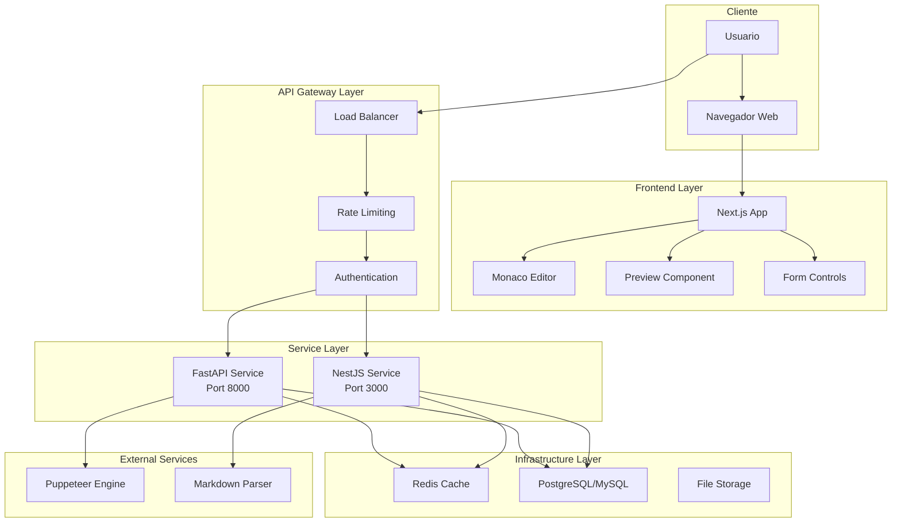
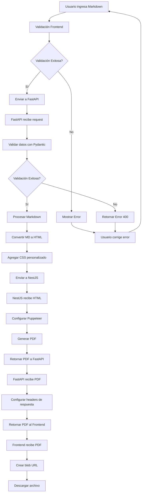
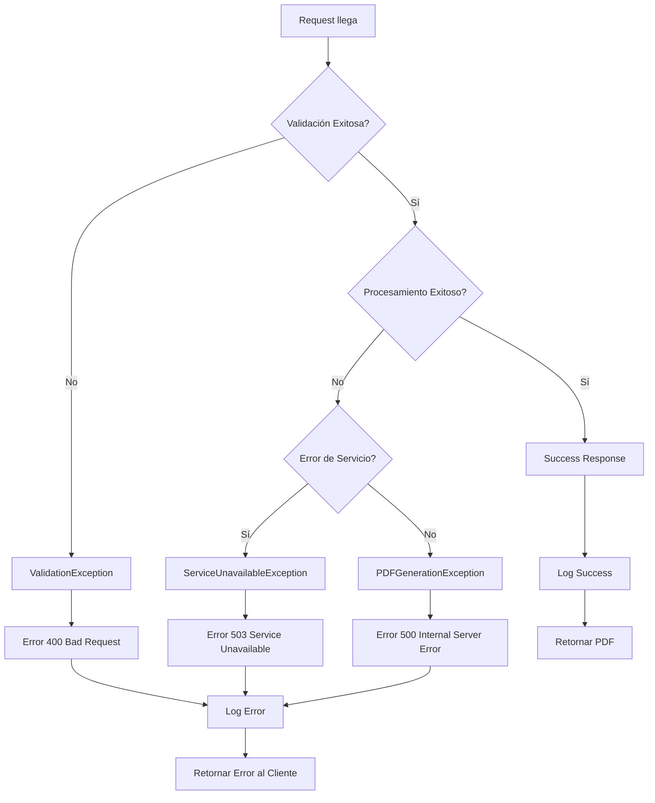
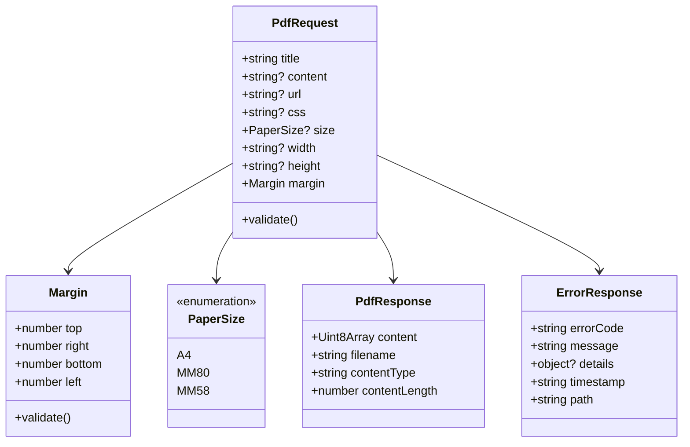
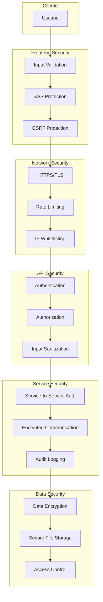
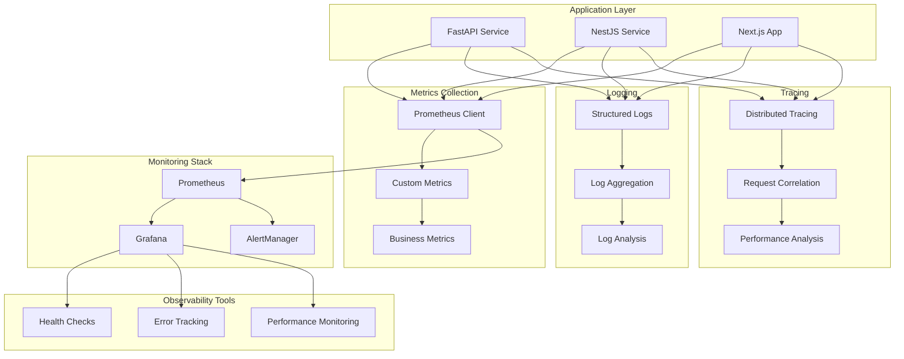
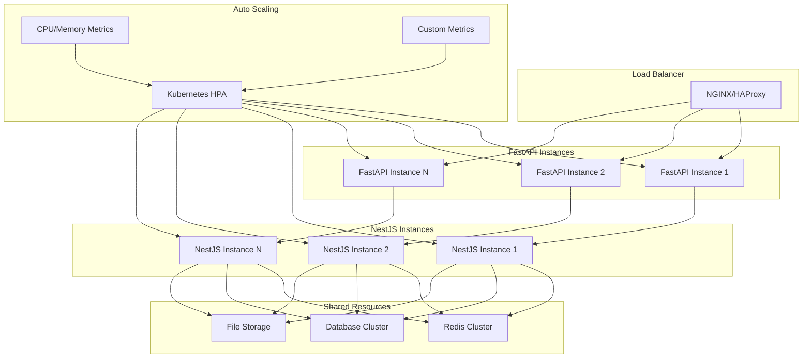
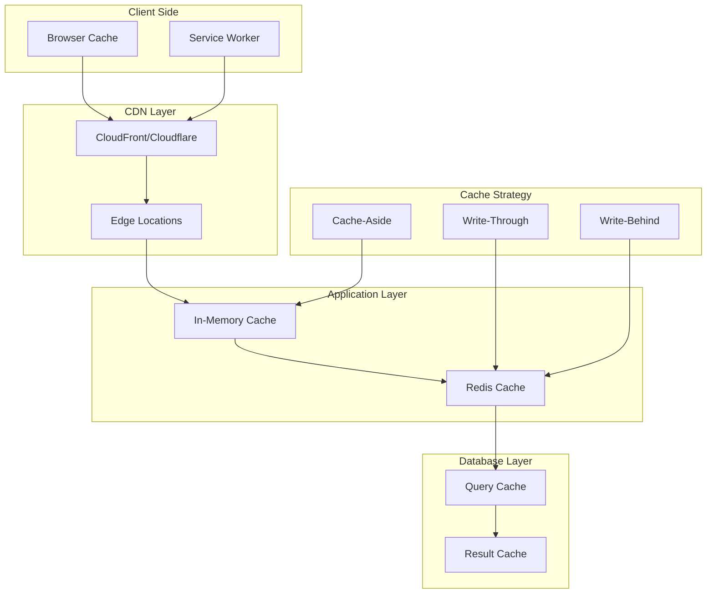
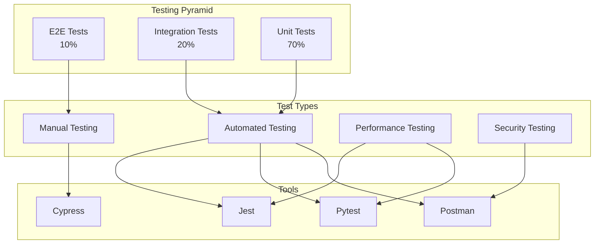
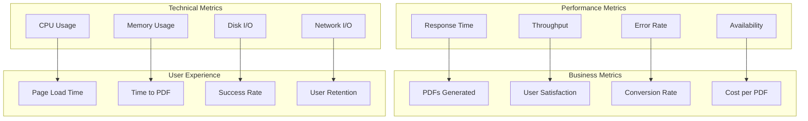

# Diagramas Técnicos del Sistema

Este documento contiene diagramas técnicos adicionales para entender mejor la arquitectura y funcionamiento del sistema MD/HTML to PDF.

## 📊 Arquitectura de Microservicios

### Vista General de la Arquitectura



## 🔄 Flujos de Procesamiento

### Flujo Completo de Conversión Markdown → PDF



### Flujo de Manejo de Errores



## 🏗️ Estructura de Datos

### Modelo de Datos del Sistema



## 🔐 Arquitectura de Seguridad

### Capas de Seguridad Implementadas y Propuestas



## 📈 Monitoreo y Observabilidad

### Stack de Monitoreo Propuesto



## 🚀 Escalabilidad y Performance

### Arquitectura de Escalabilidad Horizontal



## 🔄 Circuit Breaker Pattern

### Implementación del Circuit Breaker

```mermaid
stateDiagram-v2
    [*] --> Closed
    
    state Closed {
        [*] --> Normal
        Normal --> HighErrorRate : Error Rate > Threshold
        HighErrorRate --> Normal : Error Rate < Threshold
    }
    
    state Open {
        [*] --> Blocking
        Blocking --> HalfOpen : Timeout Reached
    }
    
    state HalfOpen {
        [*] --> Testing
        Testing --> Closed : Success
        Testing --> Open : Failure
    }
    
    Closed --> Open : Failure Threshold Reached
    Open --> HalfOpen : Recovery Timeout
    HalfOpen --> Closed : Success Threshold Reached
    HalfOpen --> Open : Failure Threshold Reached
```

## 🗄️ Patrones de Caché

### Estrategia de Caché Multi-Nivel



## 🧪 Testing Strategy

### Pirámide de Testing



## 📊 Métricas de Negocio

### KPIs del Sistema



---

Estos diagramas proporcionan una visión técnica completa del sistema y pueden ser utilizados para:

1. **Documentación técnica** para desarrolladores
2. **Presentaciones** para stakeholders
3. **Planificación** de mejoras y nuevas features
4. **Onboarding** de nuevos miembros del equipo
5. **Arquitectura** y decisiones de diseño

Los diagramas están en formato Mermaid, lo que permite:
- **Edición fácil** en GitHub y otras plataformas
- **Versionado** junto con el código
- **Exportación** a diferentes formatos
- **Integración** en documentación automática
